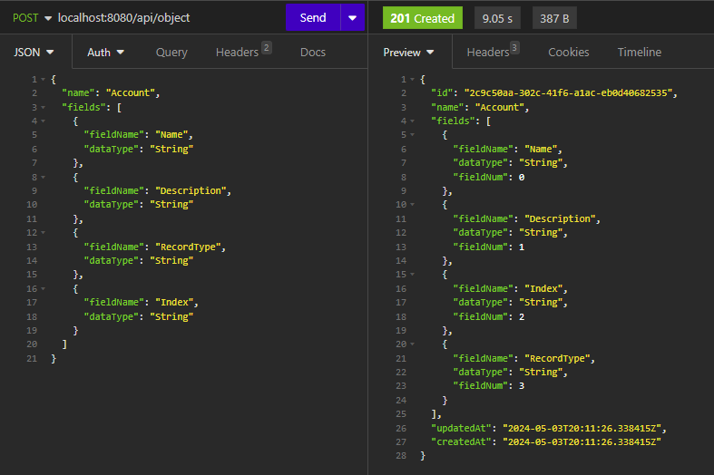
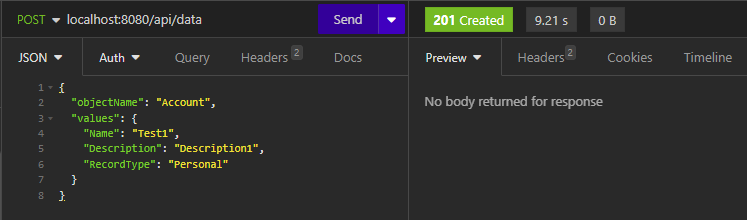
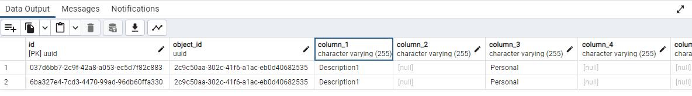
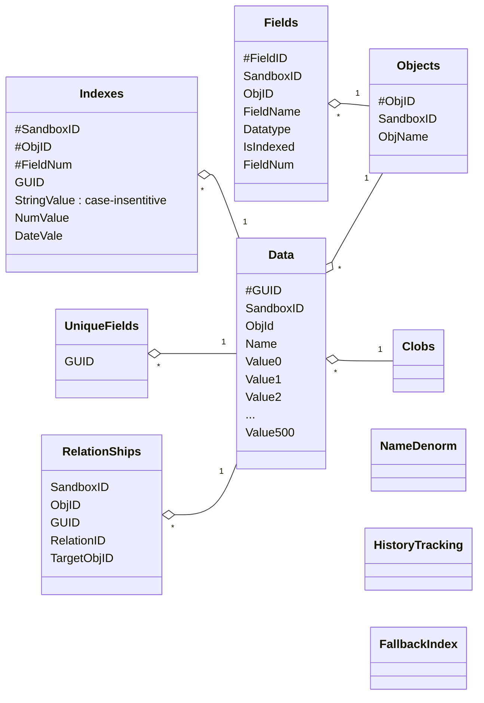

# object-entity-service

## Создание метаданные объекта

## Создание данных 

```mermaid
classDiagram
  direction RL
  class Objects {
    #ObjID
    SandboxID
    ObjName
    
  }
  class Fields{
	#FieldID
	SandboxID
	ObjID
	FieldName
	Datatype
	IsIndexed
	FieldNum
  }
  class Data{
    #GUID
    SandboxID
    ObjId
    Name
    Value0
    Value1
    Value2
    ...
    Value500
  }
  class Clobs {
  
  }
  class Indexes {
  	#SandboxID
  	#ObjID
  	#FieldNum
  	GUID
  	StringValue : case-insentitive
  	NumValue
  	DateVale
  }
  class UniqueFields {
  	GUID
  }
  class RelationShips {
  	SandboxID
  	ObjID
  	GUID
  	RelationID
  	TargetObjID
  }
  class NameDenorm {
  	
  }
  class HistoryTracking {
  
  }
  class FallbackIndex {
  
  }
  Objects "1" --o "*" Fields : 
  Objects "1" --o "*" Data : 
  Clobs "1" --o "*" Data : 
  Data "1" --o "*" Indexes : 
  Data "1" --o "*" UniqueFields
  Data "1" --o "*" RelationShips
```

RelationShips:

 - master-detail 

- lookups 

Создаем в таблице fields поле с типом relationships 

